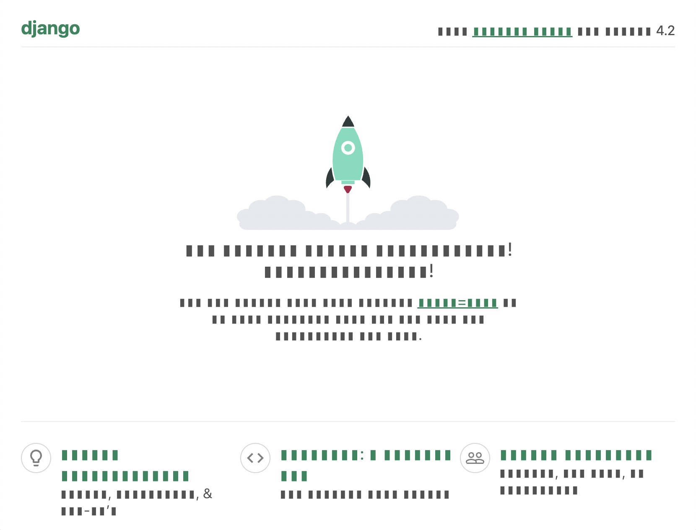

# django-fakemessages - Generate fake language files for your [Django Project](https://djangoproject.com/)

[](https://github.com/pfouque/django-fakemessages/actions/workflows/test.yml)
[](https://codecov.io/github/pfouque/django-fakemessages)
[](https://github.com/pfouque/django-fakemessages#settings)
[](https://github.com/pfouque/django-fakemessages/LICENSE)


## Introduction

**Looking for missing translations in your Django project? Let's censor what is done and see what remains!**

I wrote this while working on a project where translations were not enabled from the beginning. I
ended up hunting every single string that was missing from the translation set, and comparing two
languages by eye is tricky (even with a different alphabet).

So I wanted something much more obvious: a fake language that makes untranslated text stand out
immediately. We even used it on stagings with non-developers to quickly understand whether a
translation was simply missing or was not part of the `.po` files at all.



## Resources

-   Package on PyPI: [https://pypi.org/project/django-fakemessages/](https://pypi.org/project/django-fakemessages/)
-   Project on Github: [https://github.com/pfouque/django-fakemessages](https://github.com/pfouque/django-fakemessages)

## Requirements

-   Django >=4.2
-   Python >=3.10
-   Translate-toolkit >=3.8.5

## How to

1. Install
    ```
    $ pip install "django-fakemessages"
    ```

2. Register fakemessage in your list of Django applications:
    ```
    INSTALLED_APPS = [
        # ...
        "fakemessages",
        # ...
    ]
    ```

3. Update your settings:
    ```
    if DEBUG:
        """Add our fake language to Django"""
        from django.conf.locale import LANG_INFO

        FAKE_LANGUAGE_CODE = "kl"

        LANG_INFO[FAKE_LANGUAGE_CODE] = {
            "bidi": False,
            "code": FAKE_LANGUAGE_CODE,
            "name": "▮▮▮▮▮▮▮▮",
            "name_local": "🖖 ▮▮▮▮▮▮▮",
        }
        LANGUAGES.append((FAKE_LANGUAGE_CODE, "🖖 ▮▮▮▮▮▮▮"))
    ```

4. 🎉 Voila!


## Contribute

### Principles

-   Simple for developers to get up-and-running
-   Consistent style (`ruff`)
-   Future-proof (`pyupgrade`)
-   Full type hinting (`mypy`)

### Coding style

We use [pre-commit](https://pre-commit.com/) to run code quality tools.
[Install pre-commit](https://pre-commit.com/#install) however you like (e.g.
`pip install pre-commit` with your system python) then set up pre-commit to run every time you
commit with:

```bash
> pre-commit install
```

You can then run all tools:

```bash
> pre-commit run --all-files
```

It includes the following:

-   `uv` for project and dependency management
-   `Ruff`, `black` and `pyupgrade` linting
-   `mypy` for type checking
-   `Github Actions` for builds and CI

There are default config files for the linting and mypy.

### Tests

#### Tests package

The package tests themselves are _outside_ of the main library code, in a package that is itself a
Django app (it contains `models`, `settings`, and any other artifacts required to run the tests
(e.g. `urls`).) Where appropriate, this test app may be runnable as a Django project - so that
developers can spin up the test app and see what admin screens look like, test migrations, etc.

#### Running tests

The tests themselves use `pytest` as the test runner. If you have installed the `uv` environment,
you can run them thus:

```
$ uv run pytest
```

or

```
$ uv sync --dev
$ source .venv/bin/activate
(.venv) $ pytest
```

#### CI

- `.github/workflows/lint.yml`: Defines and ensure coding rules on Github.

- `.github/workflows/test.yml`: Runs tests on supported Python (3.12-3.14) with Django 6.0 in a GitHub matrix.

- `.github/workflows/coverage.yml`: Calculates the coverage on an up to date version.
