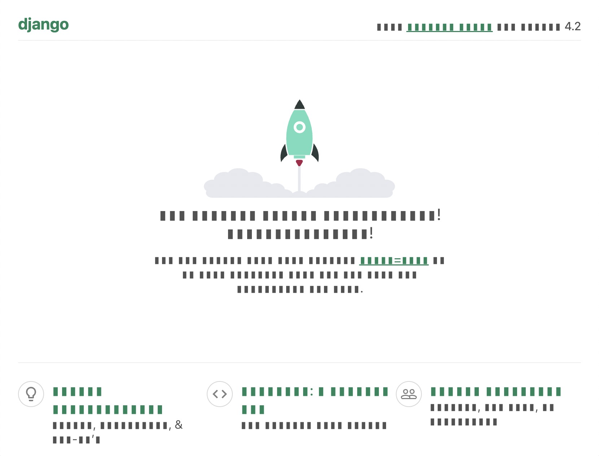

# django-fakemessages - Generate fake language files for your [Django Project](https://djangoproject.com/)

[](https://github.com/pfouque/django-fakemessages/actions/workflows/test.yml)
[](https://codecov.io/github/pfouque/django-fakemessages)
[](https://github.com/pfouque/django-fakemessages#settings)
[](https://github.com/pfouque/django-fakemessages/LICENSE)


## Introduction

**Looking for missing translations in your Django project? Let's censor what is done and see what remains!**

I wrote this while working on a project where translations were not enabled from the beginning. I
ended up hunting every single string that was missing from the translation set, and comparing two
languages by eye is tricky (even with a different alphabet).

So I wanted something much more obvious: a fake language that makes untranslated text stand out
immediately. We even used it on stagings with non-developers to quickly understand whether a
translation was simply missing or was not part of the `.po` files at all.



## Resources

-   Package on PyPI: [https://pypi.org/project/django-fakemessages/](https://pypi.org/project/django-fakemessages/)
-   Project on Github: [https://github.com/pfouque/django-fakemessages](https://github.com/pfouque/django-fakemessages)

## Requirements

-   Django >=4.2
-   Python >=3.10
-   Translate-toolkit >=3.8.5

## How to

1. Install
    ```
    $ uv add "django-fakemessages"
    ```
    or
    ```
    $ pip install "django-fakemessages"
    ```

2. Register fakemessage in your list of Django applications:
    ```
    INSTALLED_APPS = [
        # ...
        "fakemessages",
        # ...
    ]
    ```

3. Update your settings:
    ```
    if DEBUG:
        """Add our fake language to Django"""
        from django.conf.locale import LANG_INFO

        FAKE_LANGUAGE_CODE = "kl"

        LANG_INFO[FAKE_LANGUAGE_CODE] = {
            "bidi": False,
            "code": FAKE_LANGUAGE_CODE,
            "name": "▮▮▮▮▮▮▮▮",
            "name_local": "🖖 ▮▮▮▮▮▮▮",
        }
        LANGUAGES.append((FAKE_LANGUAGE_CODE, "🖖 ▮▮▮▮▮▮▮"))
    ```

4. 🎉 Voila!


## Contribute

### Principles

-   Simple for developers to get up-and-running
-   Consistent style (`ruff`)
-   Future-proof (`pyupgrade`)
-   Full type hinting (`mypy`)

### Getting started

The project is managed with [uv](https://docs.astral.sh/uv/).
[Install uv](https://docs.astral.sh/uv/getting-started/installation/), then:

```bash
> uv sync
```

That creates `.venv` from the pinned `uv.lock` and installs the `dev` dependency
group (it is the default group, so no extra flag is needed). uv also downloads a
suitable Python itself, so no system Python setup is required.

Prefix commands with `uv run` to use that environment, for example `uv run pytest`.

### Coding style

We use [prek](https://prek.j178.dev/) to run code quality tools.
[Install prek](https://prek.j178.dev/quickstart/) however you like (for example
`uv tool install prek`) then set up Git hooks to run every time you commit with:

```bash
> prek install
```

You can then run all tools:

```bash
> prek run --all-files
```

It includes the following:

-   `uv` for project and dependency management
-   `Ruff` and `pyupgrade` linting
-   `mypy` for type checking, run through `uv run` so it sees the locked
    dependencies (so `uv` must be on your `PATH` for the hooks to work)
-   `Github Actions` for builds and CI

There are default config files for the linting and mypy.

### Tests

#### Tests package

The package tests themselves are _outside_ of the main library code, in a package that is itself a
Django app (it contains `models`, `settings`, and any other artifacts required to run the tests
(e.g. `urls`).) Where appropriate, this test app may be runnable as a Django project - so that
developers can spin up the test app and see what admin screens look like, test migrations, etc.

#### Running tests

The tests themselves use `pytest` as the test runner. If you have installed the `uv` environment,
you can run them thus:

```
$ uv run pytest
```

or

```
$ uv sync
$ source .venv/bin/activate
(.venv) $ pytest
```

To run the full Python x Django matrix, use `tox`. It is wired to
[tox-uv](https://github.com/tox-dev/tox-uv), so uv builds the environments and
fetches any Python version that is missing:

```
$ uv run tox
```

```
$ uv run tox -e py313-dj52      # a single environment
$ uv run tox -f dj60            # every environment for Django 6.0
```

#### CI

- `.github/workflows/lint.yml`: Defines and ensure coding rules on Github.

- `.github/workflows/test.yml`: Runs the `tox` matrix on each supported Python (3.10-3.14)
  against every supported Django version, in a GitHub matrix.

- `.github/workflows/coverage.yml`: Calculates the coverage on an up to date version.
